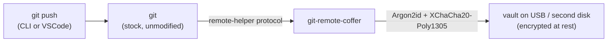

<div align="center">
  
</div>

<h1 align="center">Coffer</h1>

<p align="center">
  <strong>An encrypted git remote that lives on your own disk.</strong><br>
  Push from any git client — including VSCode — straight into a
  password-protected vault on a second disk or USB drive.
</p>

<p align="center">
  
  &nbsp;
  
  &nbsp;
  
</p>

---

Coffer turns any directory on a removable or secondary disk into a fully
encrypted git remote. `git push` works exactly the way it always has — but
the bytes that reach the disk are ciphertext. Whoever finds the drive finds
random-looking files; with the passphrase, the complete repository — every
branch, tag, and commit — can be reconstructed from the vault alone.

**Coffer is in the specification phase.** The design is complete and frozen
enough to build against; no code has been released yet. See the
[roadmap](#roadmap).

## Why

- **No third party.** The remote is a directory you control — a USB stick,
  an external drive, a second internal disk. Nothing ever leaves your
  hardware.
- **Encrypted at rest.** The entire repository — objects, refs, history — is
  sealed under passphrase encryption (Argon2id key derivation,
  XChaCha20-Poly1305 AEAD). Possessing the drive is not enough.
- **Stock git, unchanged.** Coffer is a standard
  [git remote helper](docs/architecture.md). No forked git, no wrappers to
  remember, no server to run. If `git push` works, Coffer works — and so does
  the VSCode Sync button.
- **Single static binary.** No GPG, no FUSE, no drivers, no administrator
  rights. The vault is plain files, so exFAT and FAT32 media are fully
  supported.

## Target interface

What using Coffer is designed to feel like (planned CLI, in development):

```console
$ coffer init /mnt/usb/myproject.coffer
Passphrase for new vault: ********
Vault created: /mnt/usb/myproject.coffer

$ git remote add origin coffer::/mnt/usb/myproject.coffer
$ git push -u origin main
Enumerating objects: 42, done.
Writing objects: 100% (42/42), done.
To coffer::/mnt/usb/myproject.coffer
 * [new branch]      main -> main
```

On Windows: `git remote add origin coffer::D:\backups\myproject.coffer`.

From then on, `git pull`, `git fetch`, `git clone`, and VSCode's Sync button
all work against the vault with no further configuration. The only
requirement is a stock git — validation floor 2.30, where the helper
`object-format` capability (SHA-256 repository support) first appeared.
Release notes list the exact git versions each release was tested against.
Passphrases are requested through git's own credential flow, so prompts
appear natively in the terminal or in VSCode.

## How it works



Git delegates transport for unknown URL schemes to a helper binary
(`coffer::…` makes git invoke `git-remote-coffer`). The helper reads the
pushed objects straight from your repository, encrypts them, and stores
them in the vault directory; on fetch it does the reverse, importing
decrypted objects back into your repository. Git never notices the
difference — which is why every git client stays compatible. The design
and its rationale are in [docs/architecture.md](docs/architecture.md);
the on-disk layout is specified normatively in
[docs/format-spec.md](docs/format-spec.md).

## Security scope

Coffer protects **repository data at rest on the remote medium**.

| In scope | Out of scope |
|---|---|
| Lost, stolen, copied, or forensically imaged drives | A host compromised *while* the vault is in use |
| Failure of the original working disk — the vault is a complete backup | A forgotten passphrase — there is no recovery, by design |
| Bit-rot and tampering with vault files (AEAD-verified) | Hiding vault metadata such as file count and approximate sizes |

The full analysis is in [docs/threat-model.md](docs/threat-model.md).

## How Coffer compares

| Tool | What is encrypted | Windows | Dependencies | `git push` feels native |
|---|---|---|---|---|
| **Coffer** (planned) | the whole remote | first-class | none (static binary) | yes — remote helper |
| git-remote-gcrypt | the whole remote | partial | GPG + bash | yes — remote helper |
| git-crypt, git-agecrypt | individual files inside a repo | yes | per-tool | n/a — different problem |
| VeraCrypt + bare repo | a whole volume | yes | VeraCrypt, admin rights, manual mounting | no — mount first, push second |

Coffer exists because the "whole remote, encrypted, cross-platform,
zero-dependency" quadrant is empty.

## Roadmap

- [x] **Specification** — architecture, vault format v1, threat model (current state)
- [ ] **Phase 0 — Spike** — prove the helper protocol and credential flow end-to-end on Linux and Windows
- [ ] **Phase 1 — MVP** — `git-remote-coffer` with push/fetch/clone against format v1; CI on Linux and Windows
- [ ] **Phase 2 — Hardening** — progress reporting, actionable errors, VSCode validation pass
- [ ] **Phase 3 — Key management** — multiple key slots, `rekey`, `coffer gc` / `coffer fsck`
- [ ] **Phase 4 — v1.0** — packaging (scoop, winget, Homebrew), user guide, security review

Phases with acceptance criteria: [docs/development.md](docs/development.md).

## Documentation

| Document | Purpose |
|---|---|
| [Architecture](docs/architecture.md) | design decisions, components, protocol flows |
| [Vault format specification](docs/format-spec.md) | normative on-disk format — build against this |
| [Threat model](docs/threat-model.md) | what Coffer does and does not protect |
| [Development plan](docs/development.md) | stack, phases, testing strategy, conventions |
| [Contributing](CONTRIBUTING.md) | repository rules and how to contribute |

## Contributing

Contributions are welcome. While the project is specification-only, issues
that find holes, ambiguities, or over-engineering in the docs are the most
valuable ones; implementation begins with Phase 0. All artifacts in this
repository are written in English — see [CONTRIBUTING.md](CONTRIBUTING.md).

Coffer's design follows the path proven by
[git-remote-gcrypt](https://github.com/spwhitton/git-remote-gcrypt); the goal
is to offer what gcrypt offers on Linux — everywhere, with no dependencies.

## License

[MIT](LICENSE)
