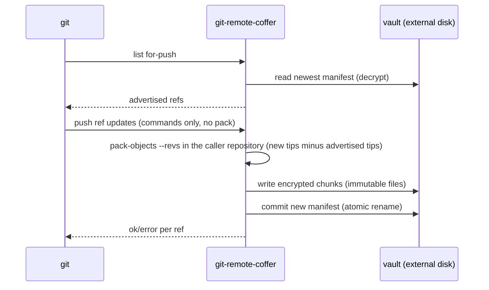

# Architecture

Coffer is a git remote helper plus a small lifecycle CLI. It stores an
encrypted git repository (a *vault*) in a plain directory on a secondary or
removable disk and lets unmodified git push to, fetch from, and clone it.

## Goals and non-goals

**Goals**

- Confidentiality and integrity of repository data at rest on the remote
  medium; the vault must be worthless to whoever holds the disk.
- A complete backup: the vault plus the passphrase must be sufficient to
  reconstruct the repository on a fresh machine.
- An experience indistinguishable from pushing to any other remote —
  including from VSCode — using stock, unmodified git.
- Linux, Windows, and macOS as first-class platforms; a single static
  binary with no runtime dependencies (no GPG, no FUSE, no drivers, no
  administrator rights).
- Crash safety: an interrupted push must never corrupt the vault.
- Cheap key rotation: changing a passphrase must not re-encrypt object data.

**Non-goals**

- Protecting a host that is compromised while the vault is in use — the
  passphrase and plaintext exist in memory during operation (see the
  [threat model](threat-model.md)).
- Metadata privacy: the number and size of vault files and their timestamps
  are visible to the medium's holder.
- Per-file transparent encryption inside a working repository — the problem
  git-crypt solves.
- Cloud transports, synchronization between multiple vaults, and
  block-level deduplication beyond what git's own packfiles provide.

## The extension point: a git remote helper

Git delegates transports for URL schemes it does not know to external
programs: a URL of the form `coffer::<path>` makes git look for an
executable named `git-remote-coffer` on `PATH` and speak the remote-helper
protocol with it over stdin/stdout (`gitremote-helpers(7)`). This is the
same mechanism used by git-remote-gcrypt and other out-of-tree transports,
and it has been stable for over a decade.

This choice is the load-bearing decision of the project:

- **Stock git is the only dependency.** Every git version a user is likely
  to run already supports helpers, so Coffer requires no forked or patched
  git and inherits compatibility with everything that shells out to git.
- **VSCode compatibility is free.** VSCode's git integration invokes the git
  CLI; as far as it can tell, `coffer::` is just another remote URL.
- **The transport is replaceable.** The helper boundary isolates all
  encryption and storage logic from git's own machinery.

Two alternatives were rejected deliberately:

- **Forking git or landing encryption in git core.** Encryption of the
  remote store would cut deep into git's object database and transport
  layers. Core git deliberately keeps non-standard transports out of tree —
  the helper mechanism exists precisely for this — and a fork would impose a
  permanent rebase burden plus require users to replace their git binary,
  breaking tooling (including VSCode's bundled git) along the way.
- **Vendoring git as a subtree.** The helper approach never modifies git
  source; embedding it would add tens of megabytes of vendored C and merge
  friction with zero benefit. If a hermetic install is ever wanted, ship the
  official git binary, not the source tree.

## Components

| Component | Role |
|---|---|
| `git-remote-coffer` | the remote helper; implements the git remote-helper protocol (`list`, `fetch`, `push`) |
| `coffer` | lifecycle CLI: `init`, `status`, `rekey`, `gc`, `fsck` |
| vault store | the on-disk format, specified normatively in [format-spec.md](format-spec.md) |
| pack glue | thin wrappers around git plumbing (`pack-objects`, `git index-pack`, `git show-index`) to move and inventory packs without reimplementing pack handling |

## Deployment model

The software lives on the **host**; the data lives on the **medium**:

- `git-remote-coffer` and `coffer` are installed on every machine you work
  from. Git discovers the helper through `PATH`, so installation is simply
  "put the binary on `PATH`" — package managers do this for you. One
  installation per machine; one vault per repository on the medium.
- The vault directory contains **only data** — never executables. The
  medium can be a USB stick, an external drive, or a second internal disk;
  the only requirement is that it is a *different physical disk* from the
  working copy, so a single disk failure cannot destroy both.
- Recovery on a fresh machine: install git and Coffer, mount the medium,
  enter the passphrase, `git clone coffer::…`. Keeping a copy of the public
  release archive next to the vault is a convenience for offline
  bootstrapping — never a dependency.

## Data flow

### Push

Verified against git's `transport-helper.c` in the Phase 0 spike: **git
never transfers a packfile to a `push`-capability helper.** The helper
receives only ref-update commands and is responsible for reading the
caller's object store itself (it inherits `GIT_DIR`).



Accuracy of advertised refs matters twice: git decides what to push by
comparing local refs against them, and the helper uses them as
`^exclusions` for `pack-objects --revs`, so each push stores only the
missing objects.

### Fetch

The mirror image, with the data direction reversed — and again no pack
crosses the helper protocol. The helper decrypts and reassembles the
packs containing the requested objects and imports them **into the
caller's object database** by piping them into `git index-pack --stdin`
in the caller's repository (inherited `GIT_DIR` and working directory),
then answers the fetch batch with a blank line.

## Cryptographic design (summary)

Normative details live in [format-spec.md](format-spec.md).

- A passphrase is stretched with **Argon2id** into a key-encryption key
  (KEK). Parameters are stored per key slot, so strength can evolve without
  a format change.
- Object data is encrypted under a random 32-byte data key (DEK). Each key
  slot stores the DEK sealed under its own KEK. Consequence: **rekeying
  touches the tiny manifest, not the object store.**
- Payloads are sealed with **XChaCha20-Poly1305** AEAD. Additional
  authenticated data binds every ciphertext to the vault, its role, and its
  position, so records cannot be replayed or reordered undetected.
- Object files are immutable; a manifest commit is write-temp, fsync, atomic
  rename. An interrupted push loses at most that push.

## Credentials and VSCode

The passphrase is set once, at `coffer init`. Afterwards it is requested
**at the start of every operation that opens the vault** — `git push`,
`git pull`, `git fetch`, `git clone` — and always through
`git credential fill`, never by reading the terminal directly:

- in a terminal, git prompts normally, once per operation;
- under VSCode, the prompt appears as a native input box at the moment the
  git command runs — that is, right after clicking Sync, Push, or Pull;
- entering it every time is the default, but git's standard
  `credential.helper` backends work exactly as with any other remote:
  in-memory caching with a TTL (`git credential-cache`), or the OS-keyring
  helper for longer-lived storage. Coffer itself never stores passphrases.

An optional key file can be required in addition to the passphrase
(`coffer.keyfile`, per remote or per vault).

For users who prefer cleaner-looking remotes, git URL rewriting hides the
scheme in everyday output:

```bash
git config --global url."coffer::/mnt/usb/".insteadOf "usb://"
# now: git remote add origin usb://myproject.coffer
```

## Platform specifics

Windows:

- The URL scheme is split at the first `::`; the remainder is a verbatim
  path: `coffer::D:\backups\repo.coffer` and UNC paths
  (`coffer::\\server\share\repo.coffer`) work unchanged.
- Helper stdio is binary-safe; the protocol handler never performs CRLF
  translation.
- The vault is a plain directory of plain files — no symlinks, no
  permissions, no reparse points — so exFAT and FAT32 media are fully
  supported and no administrator rights are needed.

macOS:

- No code path differs from Linux: POSIX fsync and atomic-rename semantics
  carry the write ordering unchanged, and terminal credential prompts
  behave the same.
- Vault file names are lowercase hex digits only, so the case-insensitive
  default APFS volume cannot mangle or collide them.

All platforms: writes are fsynced before the helper exits, so a safe
removal after a completed push is always clean; locked-file and
device-removal errors are surfaced as actionable messages, not stack
traces.
